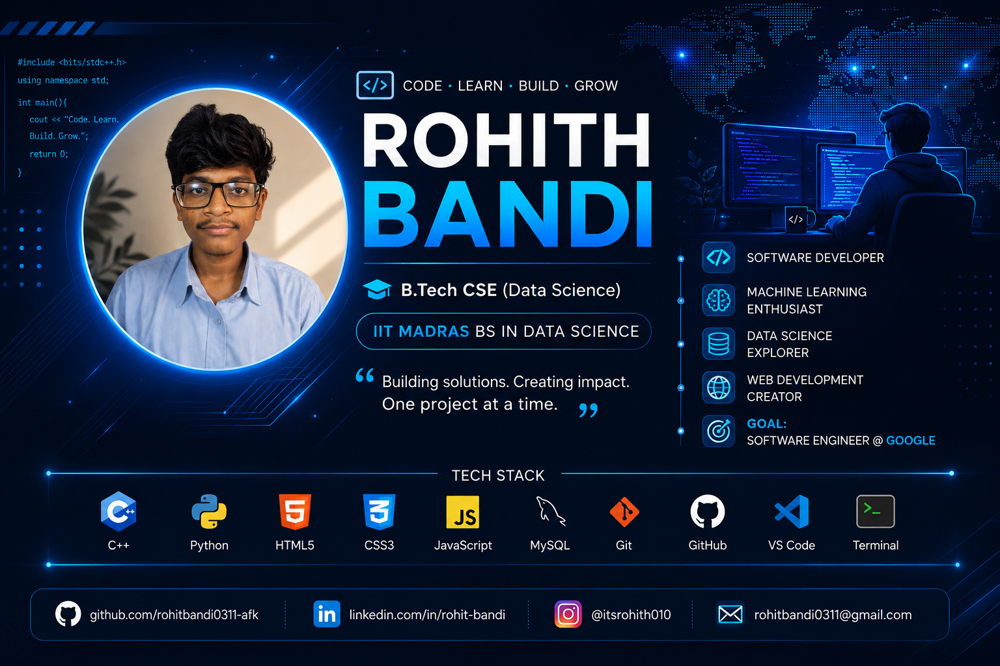

 

  

<h3>🚀 B.Tech CSE (Data Science) Student | 🎓 IIT Madras BS in Data Science</h3>

---

## 👨‍💻 About Me

- 🌱 Currently learning **C++, DSA, Python, AI & Machine Learning**
- 💻 Passionate about **Software Development & Data Science**
- 🤖 Interested in **Artificial Intelligence and Machine Learning**
- 🏆 Hackathon Participant
- 🚀 Building projects to improve my practical skills
- 🎯 Goal: **Become a Software Engineer**
- 🇮🇳 India

---

## 🛠️ Tech Stack

### 💻 Programming Languages

  

### 🔧 Tools & Technologies

---

## 🚀 Featured Projects

| Project | Description |
|---|---|
| 🤖 **AI Message Router** | AI-powered message classification and routing project |
| 🏦 **Loan Prediction** | Machine Learning project for predicting loan approval |
| 🎓 **University Management System** | DBMS project for managing university information |
| 💻 **C++ Learning Notes** | C++ programming practice and learning resources |

---
# 📊 GitHub Stats

# 🔥 GitHub Streak

---
<h2>📈 Contribution Graph</h2>

# 📈 Contribution Graph

---

# 🚀 Current Goals

- ✅ Improve **C++**
- 🔄 Master **Data Structures & Algorithms**
- 🔄 Build more **AI Projects**
- 🔄 Learn **Machine Learning**
- 🎯 Prepare for a **Software Engineering Internship**
- 🌱 Contribute to **Open Source**

---

# 🌐 Connect With Me

---

  

### ⭐ Thanks for visiting my profile! ⭐

**Keep Learning • Keep Building • Keep Growing 🚀**

